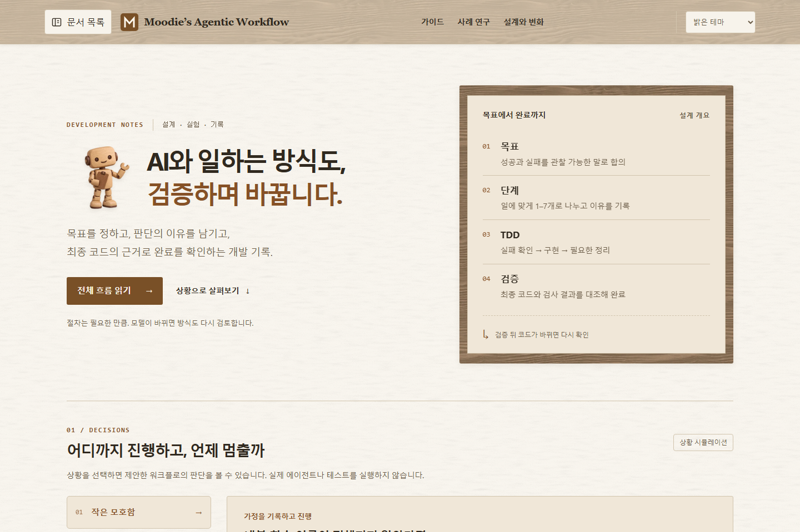

[English](README.md) | [한국어](README.ko.md)

# Moodie’s Agentic Workflow

A public notebook and portfolio about working with AI agents: how to agree on a goal, give agents room to work, and check the result with evidence.

**[Visit the website →](https://bass131.github.io/ai-workflow-documents/)**

The website is currently written in Korean. This README is available in English and Korean.

[](https://bass131.github.io/ai-workflow-documents/)

*Homepage in the light theme, captured from the local preview on September 17, 2026. Select the image to open the website.*

## What this site is for

This is a place to follow the reasoning behind an AI development workflow as it evolves. It brings together practical guides, observations from AgentDeck, and the reasons behind design changes.

It is written for developers shaping their own agent workflows and readers who want to understand the decisions behind this project. The emphasis is on what was tried, what the evidence supports, and what still needs to be tested.

## What you can explore

- **Goals and scope:** agree on observable outcomes and decide what belongs in the work.
- **Autonomy and human decisions:** let agents handle small, reversible choices; ask for input when a consequential decision exceeds the agreed scope.
- **Phases and resuming work:** use up to seven phases when useful, keeping enough context to continue after an interruption or an agent change.
- **Tests and completion:** connect TDD and regression checks to the code being delivered.
- **Experiments and design decisions:** read the AgentDeck case study, its limits, and the proposals it informed.

The homepage also has an interactive scenario explorer for situations such as a failed check or resuming a task.

## Where to start

1. [Read the workflow overview](https://bass131.github.io/ai-workflow-documents/workflow/overview/) for the main ideas.
2. [Explore the scenarios](https://bass131.github.io/ai-workflow-documents/#simulation) to see how those ideas affect a decision.
3. [Read the AgentDeck case study](https://bass131.github.io/ai-workflow-documents/experiments/agentdeck/) for a concrete observation and its limits.
4. [Follow the design decisions](https://bass131.github.io/ai-workflow-documents/design/decisions/) to see what may change with better evidence.

## Current scope

The documentation site and scenario explorer are implemented. The explorer illustrates proposed behavior; it does not run agents or tests. The program that would control workflow state and completion is still a proposal.

Some guide chapters are outlines being developed gradually. The AgentDeck case study draws on earlier, limited checks; it does not establish that this workflow outperforms alternatives or newer models.

## Working on the site

The site uses Astro, Starlight, and TypeScript, with GitHub Pages hosting. With Node 24 and npm installed:

```sh
npm ci
npm run dev
```

Use the [writing guide](docs/authoring.md) for content changes and the [deployment guide](docs/deployment.md) for validation, updates, and recovery. [Validation records](VALIDATION.md) and [asset credits](docs/asset-credits.md) document the supporting work.
